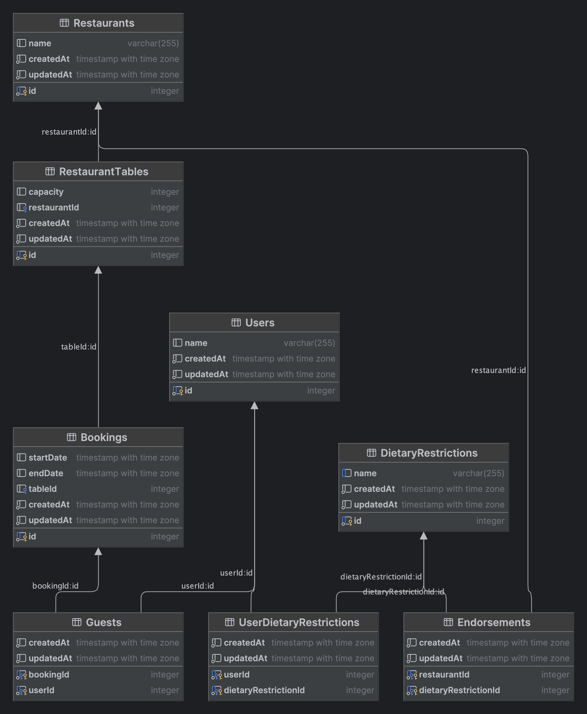

# Rec Assignment

## Introduction

This is a NestJS project which uses PostgreSQL as the database. Use the Docker Compose workflow for both development and production environments.

## Prerequisites

You must have the following installed:

- Docker
- Docker Compose
- Node.js and npm

## Environment Variables

Create a `.env` file in the project root with the following values:
````
DATABASE_USERNAME="postgres" 
DATABASE_PASSWORD="postgres" 
DATABASE="postgres" 
DATABASE_HOST="db"
````
These values will be used to connect to your PostgreSQL database.

## Development

To run this service in development mode, use the command:

````
docker-compose -f docker-compose.dev.yml up
````

Open another terminal and run the following command to seed the database:

````
npm run seed
````

## Production

To run this service in production mode, use:

````
docker-compose up
````

Seed the database as described in the Development section.

## API Documentation

To view all endpoints and Swagger documentation, visit [`localhost:3000/api`](http://localhost:3000/api) once the application is running.

## Database Diagram

Please see the database diagram below.

